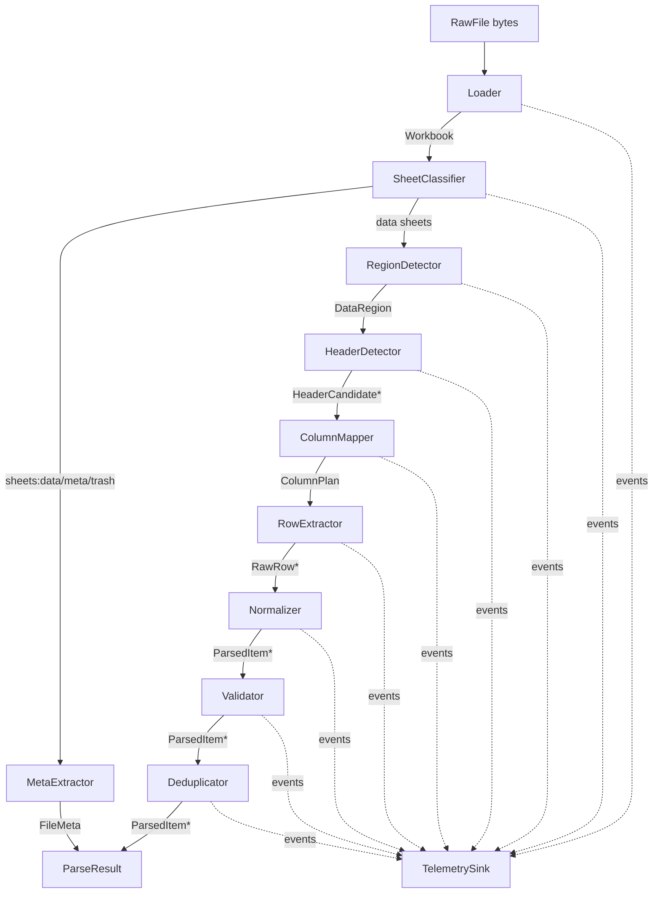
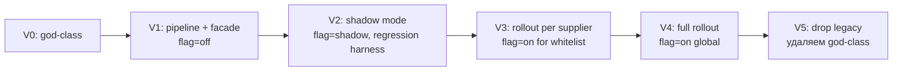
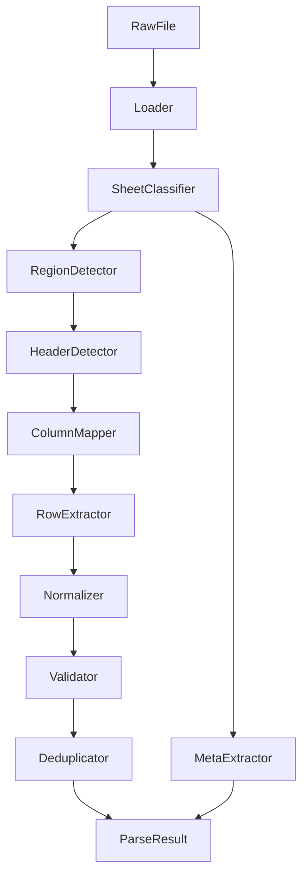
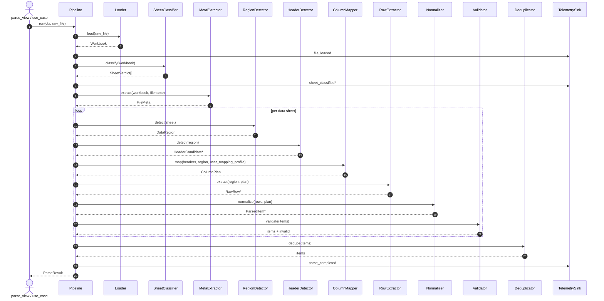

# Архитектура устойчивого парсинга Excel-прайсов

Проект: `apps-postavok` (Django, импортёр пива). Документ описывает целевую
архитектуру замены текущего god-class `backend/parser_app/parsers/excel_parser.py`
(2963 строки) и его частичного DDD-рефакторинга в
`backend/parser_app/infrastructure/parsers/excel_parser.py` (3805 строк) на
явный pipeline с контрактами, confidence-скорингом и регрессионным harness.
Документ — design only; правки кода не входят в скоп.

---

## 1. TL;DR

Предлагается заменить монолитный `ExcelParser` цепочкой stateless-стадий
`Loader → SheetClassifier → RegionDetector → HeaderDetector → ColumnMapper →
RowExtractor → Normalizer → Validator → Deduplicator → TelemetrySink`. Каждая
стадия — отдельный модуль с явным DTO-контрактом и `Protocol`-интерфейсом.
Решения о расположении заголовков, типе поставщика и сопоставлении колонок
больше не принимаются жёстко: каждый детектор возвращает
`Candidate(value, confidence, reasons)`, а финальный выбор — взвешенное
голосование с порогом и tie-break-правилами. Лексиконы и профили вынесены
в YAML-реестры (горячая перезагрузка без релиза), пользовательский маппинг
из админки сохраняется в БД и автоматически подхватывается. По сравнению
с текущей реализацией это даёт: явный `ParseResult.status` вместо тихих
пустых списков, наблюдаемость каждой стадии, регрессионный harness
на корпусе реальных прайсов и плавный план миграции — старый `parse(...)`
остаётся как фасад поверх новой цепочки.

## 2. Проблема и требования

### 2.1. Проблема

Текущий `ExcelParser` — god-class с четырьмя fallback-стратегиями чтения
листа, эвристическим поиском заголовков по топ-10 строкам, словарём
синонимов на ~30 паттернов и двумя профилями (`DistributorProfile`,
`BreweryProfile`). Логика и эвристики переплетены, скоринг — целочисленный,
без выхода наружу. Когда поставщик меняет структуру файла, парсер либо
тихо возвращает пустой список, либо подсовывает не ту колонку (например,
`stock` вместо `format_type`). Регрессии не ловятся. Параллельный
DDD-рефакторинг в `infrastructure/parsers/excel/` не доведён: его
`__init__.py` всё ещё реэкспортит старый класс.

### 2.2. Оси изменчивости входа

Целевая архитектура должна явно адресовать все 14 осей. Маппинг
"ось → раздел документа, где она решается":

| #  | Ось                                                              | Где решается                                            |
|----|------------------------------------------------------------------|---------------------------------------------------------|
| 1  | Положение строки заголовков 1..N, в т.ч. multi-row               | §4 `RegionDetector` + `HeaderDetector`; §6.1            |
| 2  | Номенклатура колонок, синонимы, опечатки, рус/англ, регистр      | §4 `ColumnMapper`; §6.2; §7 (лексиконы)                 |
| 3  | Distributor vs Brewery, brewery как префикс / в имени файла      | §4 `SheetClassifier` + `RegionDetector`; §6.3           |
| 4  | Множество листов, в т.ч. служебные                               | §4 `SheetClassifier`                                    |
| 5  | Объединённые ячейки и group-headers                              | §4 `Loader` (unmerge), `RegionDetector`, `RowExtractor` |
| 6  | Цена и остаток в визуально похожих колонках                      | §4 `ColumnMapper` (content voting); §6.2; §13           |
| 7  | Format в виде иконок/коротких слов (банка, can, ж/б, кега…)      | §4 `Normalizer`; §7 (FormatLexicon)                     |
| 8  | Объём `0,33 / 0.33 / 330 ml / 1/2 л`                             | §4 `Normalizer`; §7 (VolumeLexicon)                     |
| 9  | Валюта в отдельной колонке vs внутри строки цены ('250 руб')     | §4 `Normalizer`; §7 (CurrencyLexicon)                   |
| 10 | Сломанный xlsx (autoFilter, sharedStrings, защищённый лист)      | §4 `Loader` (sanitize)                                  |
| 11 | Пустые строки, разделители, промежуточные тоталы                 | §4 `RowExtractor`                                       |
| 12 | Google Sheets как CSV                                            | §4 `Loader` (CSV-адаптер)                               |
| 13 | Мета-данные в имени файла или верхних строках                    | §4 `SheetClassifier` + `MetaExtractor` суб-стадия       |
| 14 | Пользовательский `supplier_column_mapping` извне                 | §4 `ColumnMapper` (источник максимального приоритета); §9 |

### 2.3. Функциональные требования

- Все 14 осей выше поддерживаются явно, а не как побочный эффект эвристики.
- Контракт элемента (`ParsedItem`) формальный, версионированный, обратимо
  совместимый с текущими полями БД.
- Поддержка `.xlsx`, `.xls`, `.csv` (включая Google Sheets-экспорт).
- Внешний `supplier_column_mapping` — источник правды наивысшего приоритета.
- Возможность вернуть результат в трёх состояниях: `ok`, `partial`,
  `failed`, плюс список структурированных предупреждений.

### 2.4. Нефункциональные требования

- **Устойчивость**: добавление новой синонимики/профиля — изменение YAML
  без редеплоя кода.
- **Наблюдаемость**: каждая стадия эмитит структурированные события с
  identifier-ами файла/листа/строки.
- **Расширяемость**: новый детектор/нормализатор регистрируется через
  plugin-point, без правок ядра.
- **Производительность**: см. §10 — SLO P95 ≤ 2 c для файла ≤ 5 МБ и ≤ 5
  листов.
- **Обратная совместимость**: внешний `parse(...)` API сохраняется
  посимвольно. Внутри — feature flag `EXCEL_PARSER_PIPELINE_V2`.
- **Тестируемость**: regression harness прогоняет корпус прайсов и
  валидирует JSON-снимки результата (`ParseResult`).

## 3. Контракт `ParsedItem`

`ParsedItem` — финализированный DTO одной строки прайса. Сосуществует с
текущей моделью БД (`Beer`/`PriceItem`/...) через адаптер: мапперу не нужно
знать про Django, а слою сохранения — про эвристики.

Поля:

| Поле                | Тип                     | Назначение                                  |
|---------------------|--------------------------|---------------------------------------------|
| `brewery`           | `str?`                   | Название пивоварни                           |
| `beer_name`         | `str`                    | Название позиции                             |
| `style`             | `str?`                   | Стиль                                        |
| `abv`               | `float?` (0..100)        | Алкоголь %                                   |
| `ibu`               | `float?` (0..200)        | Горечь                                       |
| `price`             | `Decimal?` (≥ 0)         | Цена                                         |
| `currency`          | `str?` (ISO-4217 / RUB)  | Валюта                                       |
| `volume`            | `Decimal?` (литры)       | Нормализованный объём                        |
| `format_type`       | `enum` (см. ниже)        | bottle / can / keg / other                   |
| `stock`             | `int? \| Decimal?`       | Остаток                                      |
| `description`       | `str?`                   | Произвольное описание                        |
| `source_sheet`      | `str`                    | Имя листа                                    |
| `source_row`        | `int`                    | 1-based индекс строки источника              |
| `confidence`        | `float ∈ [0,1]`          | Сводная уверенность по строке                |
| `field_confidences` | `dict[str, float]`       | Уверенность по каждому полю отдельно         |
| `warnings`          | `list[ParseWarning]`     | Предупреждения, привязанные к строке         |

`format_type` ∈ `{"bottle", "can", "keg", "other", "unknown"}`. Маппинг с
русских/английских/иконочных написаний — в `FormatLexicon` (§7).

`currency` хранится в нормализованном виде. Слой `currency_raw` доступен
в `field_confidences['currency']`-events, но не в DTO.

Сосуществование с текущей БД: адаптер `ParsedItem → DBPriceItem` в
`application/use_cases/parsing_service.py` берёт только подмножество полей,
которые сейчас сохраняются. `confidence`, `warnings` и `field_confidences`
не теряются: пишутся в новую таблицу `parsing_audit` (§9, §11).

JSON Schema — см. `contracts/parsed_item.schema.json` (draft-07).

## 4. Архитектура pipeline

Каждая стадия — stateless callable с типизированным DTO на входе и
выходе. Композиция — `Pipeline.run(ctx, raw_file) -> ParseResult`. Контекст
содержит конфигурацию, лексиконы, флаги, telemetry sink.

### 4.1. Граф стадий



### 4.2. Стадии — назначение и решения

#### Loader

Принимает `RawFile` (bytes + filename + mime-hint), возвращает `Workbook`.
Скрывает форматы:

- xlsx → `openpyxl` через временный файл + sanitize: распаковать zip,
  удалить битые `<autoFilter>` (как в текущем `_create_temp_file_without_filters`),
  починить кодировку `sharedStrings.xml`, снять защиту листа на чтение.
- xls → `xlrd==1.2.0` (legacy) или конверсия `libreoffice --convert-to xlsx`
  как fallback (опц., feature flag).
- csv / google sheets export → `csv.Sniffer` для разделителя/кодировки.

Раскрытие merged cells: для каждого merged-range — копия значения в каждую
ячейку диапазона (для последующего корректного скоринга строк).

Адресует ось 10 (битые xlsx) и ось 12 (CSV).

#### SheetClassifier

Делит листы на `data | meta | trash`:

- `data` — лист с прайсом.
- `meta` — лист "Контакты", "Условия", "Прочитай" (по лексикону).
- `trash` — пустой/один-два значения/только картинки.

Признаки: имя листа, плотность непустых ячеек, наличие лексиконных
заголовков, доля числовых клеток. Возвращает `SheetVerdict` со
скоринг-матрицей. Адресует оси 4 и 13.

#### MetaExtractor

Суб-стадия: из верхних 1–5 строк data-листа и из имени файла извлекает
поставщика, дату прайса, валюту по умолчанию. Использует regex-реестр
`MetaPatterns.yaml`. Не блокирующая: при провале даёт пустой `FileMeta`.
Адресует ось 13.

#### RegionDetector

Находит непрерывный data-region в листе (от строки заголовка вниз до первой
"длинной пустой полосы" или явного total-маркера). Учитывает group-headers:
строки, где значимая ячейка — единственная и совпадает с лексиконом
brewery; такие строки помечаются как `GroupHeader(brewery=...)` и
прокидываются в `RowExtractor` как контекст для последующих data-строк.
Адресует оси 1 и 5.

#### HeaderDetector

На вход — `DataRegion`. Возвращает список `HeaderCandidate` с confidence.
Поддерживает multi-row headers: пробует объединить N подряд идущих строк
в один логический заголовок (concat с разделителем `\n`), если по
отдельности они не дают score выше порога, но вместе дают. Формула
confidence — §6.1. Адресует ось 1.

#### ColumnMapper

Принимает `HeaderCandidate` + `DataRegion` + опциональный
`SupplierColumnMapping` (от админа) + `SupplierProfile` (если детектор
определил тип поставщика).

Источники предложений (по убыванию приоритета):

1. **Explicit user mapping** — `supplier_column_mapping` (наивысший вес,
   confidence = 1.0, причина "user_override").
2. **Header-based** — exact match с лексиконом → stem match → fuzzy
   (RapidFuzz ratio) → embedding match (опц., если включён LLM-плагин).
3. **Content-based** — анализ содержимого колонки: доля числовых
   значений, диапазон, регулярные выражения (например, `^\d+([.,]\d+)?\s*(л|ml|мл)?$`
   для volume).
4. **Profile-based** — partial mapping от `DistributorProfile` /
   `BreweryProfile` (как в текущем коде, но как ещё один кандидат, а не
   как окончательный ответ).
5. **Position-based fallback** — последний резерв (как
   `_guess_column_mapping`).

Возвращает `ColumnPlan: dict[Field, list[Candidate]]`. Финальный выбор
для каждого поля — взвешенный voting (§6.2). Адресует оси 2, 6, 14.

#### RowExtractor

Классифицирует строки внутри region:

- `data` — строка с продуктом.
- `group_header` — заголовок группы (поднимает контекст brewery).
- `total` — строка тоталов (отбрасывается).
- `divider` — пустая или из одних дефисов.
- `noise` — строка с одной непустой ячейкой не в первой колонке (часто
  комментарии).

Признаки классификации: количество непустых ячеек, доля числовых,
наличие лексиконных слов "итого/total/всего", совпадение единственной
непустой ячейки с brewery-лексиконом. Адресует оси 5 и 11.

#### Normalizer

Принимает `RawRow` + `ColumnPlan`, выдаёт `ParsedItem` с нормализованными
значениями. Делегирует:

- `VolumeNormalizer` — `0,33 / 0.33 / 330 ml / 330 мл / 1/2 л → Decimal`
  в литрах.
- `CurrencyNormalizer` — `250 руб / 250₽ / RUB 250 / $5` → `(250, 'RUB')`.
- `FormatNormalizer` — `банка / can / ж/б / кега / keg / б` → enum.
- `AbvNormalizer` — `5,5% / 5.5 / 0.055` (если число < 1, считаем долей).

Каждый нормализатор может вернуть `NormalizationFailure(field, reason)` —
прокидывается в `field_confidences[field] = 0.0` и в `warnings`.
Адресует оси 7, 8, 9.

#### Validator

Range-checks (`abv ∈ [0, 100]`, `ibu ∈ [0, 200]`, `price > 0`,
`volume ∈ [0.05, 50]`), обязательность полей (`beer_name`, `price`).
Невалидные строки не отбрасываются молча: помечаются `status=invalid`
с конкретными `ParseError`-ами и попадают в `ParseResult.invalid_items`.

#### Deduplicator

Использует существующий `domain/services/deduplication.py`. Ключ
дедупа: `(brewery_normalized, beer_name_normalized, volume, format_type)`.
При коллизии оставляет элемент с максимальной `confidence`, сливает
`warnings`.

#### TelemetrySink

Получает события всех стадий, пишет в Django logging + (опц.) OTLP.
Полный список событий — §11.

## 5. Контракты модулей

Псевдокод — в `contracts/pipeline.py` (`Protocol`/`dataclass`, без
реализации). Здесь — концептуальный обзор.

### 5.1. DTO

```python
@dataclass(frozen=True)
class RawFile:
    filename: str
    content: bytes
    mime_hint: str | None

@dataclass(frozen=True)
class Workbook:
    source: RawFile
    sheets: list[Sheet]

@dataclass(frozen=True)
class Sheet:
    name: str
    cells: list[list[CellValue]]   # после unmerge
    merged_ranges: list[MergedRange]

@dataclass(frozen=True)
class SheetVerdict:
    sheet: Sheet
    kind: Literal["data", "meta", "trash"]
    confidence: float
    reasons: list[str]

@dataclass(frozen=True)
class FileMeta:
    supplier_name: str | None
    price_date: date | None
    default_currency: str | None
    confidence: float

@dataclass(frozen=True)
class DataRegion:
    sheet: Sheet
    row_start: int
    row_end: int
    col_start: int
    col_end: int

@dataclass(frozen=True)
class HeaderCandidate:
    rows: tuple[int, ...]              # 1 или несколько строк (multi-row)
    headers: list[str]                 # объединённые заголовки по колонкам
    confidence: float
    reasons: list[str]

@dataclass(frozen=True)
class Candidate[T]:
    value: T
    confidence: float                  # [0, 1]
    reasons: list[str]
    source: str                        # "user" | "header" | "content" | "profile" | "position"

@dataclass(frozen=True)
class ColumnPlan:
    mapping: dict[Field, Candidate[int]]   # Field → индекс колонки
    rejected: dict[Field, list[Candidate[int]]]
    overall_confidence: float

@dataclass(frozen=True)
class RawRow:
    sheet: str
    row_index: int
    cells: list[CellValue]
    kind: Literal["data", "group_header", "total", "divider", "noise"]
    group_context: dict[str, str]      # например {"brewery": "..."}

@dataclass(frozen=True)
class ParsedItem:
    # см. §3

@dataclass(frozen=True)
class ParseWarning:
    code: str
    message: str
    sheet: str | None
    row: int | None
    field: str | None

@dataclass(frozen=True)
class ParseError(ParseWarning):
    pass

@dataclass(frozen=True)
class ParseResult:
    status: Literal["ok", "partial", "failed"]
    items: list[ParsedItem]
    invalid_items: list[ParsedItem]
    warnings: list[ParseWarning]
    errors: list[ParseError]
    file_meta: FileMeta
    pipeline_version: str
```

### 5.2. Что значит "провал" на каждой стадии

| Стадия            | Провал                                                | Поведение                                                                  |
|-------------------|-------------------------------------------------------|----------------------------------------------------------------------------|
| Loader            | Невалидный/защищённый/нечитаемый файл                 | `raise FileLoadError`; `ParseResult.status = "failed"`                     |
| SheetClassifier   | Все листы → `trash`                                    | `status="failed"`, `error="no_data_sheets"`                                |
| RegionDetector    | Не нашёл region                                        | warning `region_not_found`, лист пропускается                              |
| HeaderDetector    | Нет кандидата с confidence ≥ порога                    | warning `header_ambiguous`, fallback к position-based маппингу             |
| ColumnMapper      | Не закрыты обязательные поля (`beer_name`, `price`)    | error `mandatory_fields_missing`, лист пропускается                        |
| RowExtractor      | Все строки → `noise`/`divider`                         | warning `no_data_rows`                                                     |
| Normalizer        | Поле не нормализуется                                  | `field_confidences[f] = 0`, warning `normalization_failed`                 |
| Validator         | Строка вне range или без обязательных                  | строка → `invalid_items`, не блокирует остальные                           |
| Deduplicator      | Дубликат                                                | warning `duplicate_dropped`                                                |

Глобальное правило: пустого результата без `errors` быть не может. Если
items пуст — `status` не может быть `"ok"`.

### 5.3. Интерфейсы (`Protocol`)

См. `contracts/pipeline.py`. Каждая стадия — `Protocol` с одним методом
`run(...)`. Pipeline инстанцируется DI-контейнером, зависимости (лексиконы,
профили, telemetry) передаются через `PipelineContext`.

## 6. Confidence & voting

Каждый детектор возвращает `Candidate(value, confidence ∈ [0,1], reasons,
source)`. Источники имеют веса (конфигурируются, defaults ниже):

| Source              | Weight |
|---------------------|--------|
| `user`              | 1.00   |
| `header_exact`      | 0.90   |
| `header_stem`       | 0.75   |
| `header_fuzzy`      | 0.60   |
| `header_embedding`  | 0.55   |
| `content`           | 0.65   |
| `profile`           | 0.50   |
| `position`          | 0.30   |

Финальный score кандидата для поля `f`:

```
score(c) = c.confidence * weight(c.source)
```

Победитель — argmax по score. Порог принятия `θ_field = 0.45` (для
обязательных полей `beer_name`, `price`) и `θ_optional = 0.30`. Ниже
порога — поле помечается ambiguous, в UI админа подсвечивается.

### 6.1. Confidence для HeaderDetector

```
header_confidence(row) =
    0.4 * lex_match_ratio(row)        # доля колонок, совпавших с лексиконом
  + 0.3 * non_empty_ratio(row)        # плотность непустых ячеек
  + 0.2 * (1 - numeric_ratio(row))    # заголовки редко содержат числа
  + 0.1 * unique_ratio(row)           # уникальность значений
```

Multi-row case: для пары `(row_i, row_{i+1})` — confidence по объединённому
вектору. Если он выше каждого по отдельности минимум на 0.1 — multi-row
выигрывает. Границы поиска: первые 30 строк или до первой строки, где
доля числовых ячеек ≥ 0.5 (это уже данные).

Short-circuit: если в строке одновременно встречаются brewery + product +
price headers по точному совпадению, confidence = 0.95 без оценки
плотности.

### 6.2. Confidence для ColumnMapper

Per-field per-source (примеры):

- `header_exact`: 1.0 при exact match с лексиконом, 0 иначе.
- `header_stem`: `RapidFuzz.token_set_ratio / 100`, фильтр ≥ 0.85.
- `header_fuzzy`: `RapidFuzz.ratio / 100`, фильтр ≥ 0.7.
- `content` (price): `numeric_ratio(col) * range_fit` где `range_fit` —
  доля значений в диапазоне `[10, 100000]`.
- `content` (volume): доля строк, матчящих regex объёма.
- `content` (stock): `numeric_ratio` ∧ `mean(values) ≤ 10000` ∧
  `diff_from_price_col`. Решает ось 6 — отделяет stock от price.

Tie-break (равные scores):
1. Источник с большим весом.
2. Меньший индекс колонки (левая колонка обычно primary).
3. Больший `non_empty_ratio` колонки.

### 6.3. Confidence для SupplierTypeDetector

Признаки и веса:
- наличие колонки brewery в `ColumnPlan` → +0.5 distributor.
- одна уникальная brewery в данных → +0.4 brewery-only.
- имя файла содержит лексиконные подсказки → +0.2 (лексикон в YAML, не
  hardcoded имена).
- больше одного листа с разными brewery → +0.3 distributor.

Hardcoded имена ('paradox', 'alisperi', 'two peaks') — антипаттерн,
переносятся в YAML-реестр `supplier_hints.yaml` без правок кода.

## 7. Реестры

Все знания о синонимах, профилях и подсказках — внешние данные, не код.

| Реестр                       | Формат | Где                                   | Кто меняет        |
|------------------------------|--------|---------------------------------------|-------------------|
| `field_lexicon.yaml`         | YAML   | `backend/parser_app/registries/`      | разработчик в PR  |
| `format_lexicon.yaml`        | YAML   | то же                                 | разработчик       |
| `currency_lexicon.yaml`      | YAML   | то же                                 | разработчик       |
| `volume_patterns.yaml`       | YAML   | то же                                 | разработчик       |
| `supplier_hints.yaml`        | YAML   | то же                                 | разработчик       |
| `meta_patterns.yaml`         | YAML   | то же                                 | разработчик       |
| `SupplierColumnMapping`      | БД     | модель в Django                       | админ через UI    |
| `SupplierProfileOverride`    | БД     | модель в Django                       | админ через UI    |

YAML-реестры подгружаются с диска при старте процесса; в DEBUG —
hot-reload по mtime. БД-реестры подтягиваются на каждый запрос
(индекс по `supplier_id` + `file_hash_prefix`).

Пример `field_lexicon.yaml`:

```yaml
brewery:
  ru: [пивоварня, пивзавод, производитель, бренд]
  en: [brewery, producer, brand]
beer_name:
  ru: [наименование, название, продукт, позиция]
  en: [name, product, item]
price:
  ru: [цена, стоимость, цена за ед, цена за бутылку]
  en: [price, cost, unit price]
# ...
```

## 8. Расширяемость

Plug-in points (всё через registry-pattern):

- **Новый тип поставщика**: добавить запись в `supplier_hints.yaml` +
  опционально подкласс `SupplierProfile` с тегом, регистрируется через
  `@register_profile("my_type")`.
- **Новое поле**: добавить в `Field` enum, в `ParsedItem` (с
  default `None`), в `field_lexicon.yaml`. JSON Schema версионируется
  (`pipeline_version`).
- **Новый детектор**: реализовать `Protocol`, регистрировать через
  `@register_detector(stage="header")`.
- **Новый Loader-формат**: реализовать `LoaderAdapter` и зарегистрировать
  по mime/ext.

Pipeline поддерживает несколько детекторов на стадию: их предложения
агрегируются в общий voting.

## 9. Обратная связь от пользователя

Когда админ в UI правит маппинг колонок для конкретного файла/поставщика,
правка сохраняется в БД и потом автоматически применяется.

Схема:

```text
SupplierColumnMapping
  id              UUID PK
  supplier_id     FK to Supplier
  file_pattern    str         # glob по имени файла, например "Paradox*.xlsx"
  sheet_pattern   str | null
  mapping         JSONB       # {"price": "Cena USD", "volume": "Объём"}
  scope           enum        # "exact_file" | "supplier" | "global"
  created_by      FK to User
  created_at      timestamp
  hits_count      int         # инкрементируется при использовании
  last_used_at    timestamp

ParsingFeedback
  id              UUID PK
  parse_run_id    FK to ParseRun
  field           str
  expected        text
  actual          text
  resolution      enum        # "fixed_in_mapping" | "fixed_in_lexicon" | "ignored"

ParseRun                       # см. также §11
  id              UUID PK
  file_hash       str
  status          enum         # ParseResult.status
  pipeline_version str
  result          JSONB        # сериализованный ParseResult
  created_at      timestamp
```

Petr-loop: правка в `SupplierColumnMapping` → следующий парсинг того же
поставщика берёт её как `user`-источник (вес 1.0) → если
`hits_count ≥ N`, инфраструктура предлагает админу promote в
`field_lexicon.yaml` как новый синоним (review-флоу через PR).

## 10. Производительность

### 10.1. SLO

| Профиль                         | P95 latency | Память |
|---------------------------------|-------------|--------|
| ≤ 5 МБ, ≤ 5 листов, ≤ 5k строк  | ≤ 2.0 c     | ≤ 200 МБ |
| ≤ 20 МБ, ≤ 20 листов            | ≤ 8.0 c     | ≤ 500 МБ |
| > 20 МБ                          | streaming   | ≤ 1 ГБ  |

### 10.2. Решения

- **Loader** — однократное чтение листа в numpy-массив объектов; merged
  ranges — second pass (O(merged), не O(N²)).
- **HeaderDetector** — текущая реализация ограничивает top-10 строк/
  top-10 паттернов/top-20 колонок ради скорости. В новой архитектуре
  лимит снимается до top-30 строк / 200 колонок (ширина current top-200
  колонок Excel хватает для всех известных прайсов), но скоринг
  векторизован numpy, поэтому P95 не деградирует.
- **ColumnMapper** — fuzzy/embedding-сравнения только для тех колонок,
  где exact/stem не дали кандидата с confidence ≥ 0.7.
- **Streaming-mode** — для файлов > 20 МБ Loader работает в
  `read_only=True` (openpyxl), стадии получают итераторы строк.
- **Кэш**: lexicon в памяти, supplier-mapping — `lru_cache` по
  `supplier_id`.
- **Параллелизм**: листы внутри файла обрабатываются в ThreadPool
  (I/O-bound на чтение) или ProcessPool (CPU-bound нормализация),
  feature flag `EXCEL_PARSER_PARALLEL_SHEETS`.

### 10.3. Сравнение с текущим парсером

| Аспект                              | Сейчас               | Новая архитектура       |
|-------------------------------------|----------------------|-------------------------|
| Лимит top-N строк для header        | 10 (хардкод)         | 30 (конфиг), векторизация |
| Лимит top-N колонок                 | 20 (хардкод)         | 200 (конфиг)            |
| Multi-row headers                   | нет                  | да                      |
| Stream-режим                        | нет                  | да (>20 МБ)             |
| Параллельные листы                  | нет                  | да (под flag)           |

## 11. Наблюдаемость

Структурированные события (JSON, ключ `event` обязателен). Все события
получают `parse_run_id`, `file_hash`, `pipeline_version`, `ts`.

| Event                        | Поля                                                       |
|------------------------------|------------------------------------------------------------|
| `file_loaded`                | `bytes`, `sheet_count`, `loader`                          |
| `sheet_classified`           | `sheet`, `kind`, `confidence`, `reasons`                  |
| `meta_extracted`             | `supplier_name`, `price_date`, `confidence`               |
| `region_detected`            | `sheet`, `row_start`, `row_end`, `col_start`, `col_end`   |
| `header_detected`            | `sheet`, `rows`, `confidence`, `reasons`                  |
| `header_ambiguous`           | `sheet`, `top_candidates: list`                           |
| `column_mapped`              | `sheet`, `field`, `source_col`, `source`, `confidence`    |
| `column_rejected`            | `sheet`, `field`, `candidate`, `reason`                   |
| `row_classified`             | `sheet`, `row`, `kind`                                     |
| `row_dropped`                | `sheet`, `row`, `reason`                                   |
| `normalization_failed`       | `sheet`, `row`, `field`, `raw_value`, `reason`            |
| `validation_failed`          | `sheet`, `row`, `field`, `value`, `rule`                  |
| `duplicate_dropped`          | `key`, `kept_row`, `dropped_row`                          |
| `parse_completed`            | `status`, `items`, `invalid`, `duration_ms`               |

Sink-и: Django logging (JSONFormatter) → stdout/file; опц. OTLP-exporter
(`opentelemetry-exporter-otlp`) под feature flag. Метрики (Prometheus):
- `parser_files_total{status}`
- `parser_duration_seconds{stage}` (histogram)
- `parser_header_confidence` (histogram)
- `parser_column_confidence{field}` (histogram)
- `parser_rows_dropped_total{reason}`

Каждый `ParseResult` сериализуется в `ParseRun` (§9) для
post-mortem-анализа.

## 12. Backward compatibility

Внешний API:

```python
class ExcelParser(BaseParser):
    def parse(
        self,
        supplier_type: str | None = None,
        brewery_name: str | None = None,
        supplier_column_mapping: dict | None = None,
    ) -> list[dict]:
        ...
```

После внедрения V2 этот метод остаётся как **тонкий фасад**:

1. Собирает `RawFile` и `PipelineContext`.
2. Запускает `Pipeline.run(ctx, raw_file)`.
3. Конвертирует `ParseResult.items` в `list[dict]` (старый формат).
4. Логирует `warnings`/`errors`, но не возвращает их (для совместимости).

Feature flag `EXCEL_PARSER_PIPELINE_V2`:

- `off` (по умолчанию на старте миграции) — старый код.
- `shadow` — оба парсера, результаты сравниваются в логах, отдаётся
  старый. Используется для регрессии.
- `on` — новый pipeline, старый код мёртвый, удаляется в финале миграции.

`SupplierProfile`-классы, `DataNormalizer`, `validators.py`, `utils.py`
остаются по своим путям, но рефакторятся под новый интерфейс
(`DataNormalizer` → `Normalizer`-stage; `validators.py` → `Validator`-stage).

Параллельный DDD-рефакторинг в `infrastructure/parsers/excel/` —
основа для V2: его `__init__.py` сейчас реэкспортит legacy `ExcelParser`,
после миграции реэкспорт убирается, а внутренние модули (`formatting_checker`,
`domain/services/{deduplication, normalization}`,
`application/use_cases/parsing_service`) встают на свои места в новой
схеме.

### 12.1. План миграции



На каждом шаге — measurable exit criteria: regression harness ≥ 95%
PASS на корпусе, P95 ≤ SLO, % rows с `confidence < 0.45` ≤ 5%.

## 13. Что считается failure

Тихий пустой результат запрещён. `ParseResult` — единственный возвращаемый
объект, и его `status` обязателен:

- `ok` — все обязательные поля закрыты, нет критических ошибок,
  `len(items) > 0`.
- `partial` — есть items, но также есть warnings/invalid_items или
  отдельные листы упали.
- `failed` — `len(items) == 0` или критическая ошибка (Loader/
  SheetClassifier).

`ParseError` ≠ `ParseWarning`. Error означает, что данные не получены
(минимум на уровне листа). Warning — данные получены, но с оговоркой
(низкая confidence, normalization fail).

Случаи, которые в текущем коде уходят в тишину и теперь явно failed:

- autoFilter не санитизировался → `LoaderError("autofilter_xml_invalid")`.
- Все листы — meta/trash → `SheetClassifierError("no_data_sheets")`.
- HeaderDetector не уверен ни в одном кандидате И content-mapping не
  закрыл обязательные поля → `ColumnMapperError("mandatory_fields_missing")`.
- Все строки → noise/divider → `RowExtractorWarning("no_data_rows")` +
  `status="failed"` если items пуст.

Текущая постпроверка "stock похож на format_type / совпал с price" —
теперь явный warning + перевыбор кандидата (§6.2 content-based).

## 14. Mermaid-диаграммы

### 14.1. Pipeline (см. также §4.1)



### 14.2. Sequence для одного файла



### 14.3. Класс-диаграмма модулей

```mermaid
classDiagram
    class PipelineContext {
        +Lexicons lexicons
        +Profiles profiles
        +TelemetrySink telemetry
        +PipelineConfig config
    }
    class Pipeline {
        +run(ctx, raw_file) ParseResult
    }
    class Loader { <<Protocol>> +load(raw_file) Workbook }
    class SheetClassifier { <<Protocol>> +classify(wb) SheetVerdict[] }
    class MetaExtractor { <<Protocol>> +extract(wb, fname) FileMeta }
    class RegionDetector { <<Protocol>> +detect(sheet) DataRegion }
    class HeaderDetector { <<Protocol>> +detect(region) HeaderCandidate[] }
    class ColumnMapper { <<Protocol>> +map(headers, region, user, profile) ColumnPlan }
    class RowExtractor { <<Protocol>> +extract(region, plan) RawRow[] }
    class Normalizer { <<Protocol>> +normalize(rows, plan) ParsedItem[] }
    class Validator { <<Protocol>> +validate(items) (valid, invalid) }
    class Deduplicator { <<Protocol>> +dedupe(items) ParsedItem[] }
    class TelemetrySink { <<Protocol>> +emit(event) }

    Pipeline o-- PipelineContext
    Pipeline o-- Loader
    Pipeline o-- SheetClassifier
    Pipeline o-- MetaExtractor
    Pipeline o-- RegionDetector
    Pipeline o-- HeaderDetector
    Pipeline o-- ColumnMapper
    Pipeline o-- RowExtractor
    Pipeline o-- Normalizer
    Pipeline o-- Validator
    Pipeline o-- Deduplicator
    Pipeline o-- TelemetrySink
```



## 15. Известные риски

| Риск                                                    | Вероятность | Митигация                                                              |
|---------------------------------------------------------|-------------|------------------------------------------------------------------------|
| Multi-row headers ломают индексацию строк               | Средняя     | `HeaderCandidate.rows: tuple[int, ...]` + последняя строка хедера = старт data |
| Group-header строки трактуются как data                 | Высокая     | RowExtractor классификатор + лексикон brewery + признак "single non-empty cell" |
| Ambiguous columns (price vs stock vs цена за упак)      | Высокая     | Content-based scoring + явный warning `column_ambiguous` админу         |
| Encoding issues в xls/csv (cp1251 vs utf-8)             | Средняя     | `chardet` в Loader, фолбэк cp1251 для русских xls                       |
| Защищённые листы / read-only                            | Низкая      | Loader возвращает `LoaderError("sheet_protected")`, без попыток обхода  |
| Очень широкие листы (>500 колонок)                      | Низкая      | Hard-cap 1000 колонок, иначе `LoaderWarning("wide_sheet")`              |
| Подмена брендов в имени файла (антипаттерн в legacy)    | Средняя     | Перенос в YAML-реестр, проверка через PR-review, не код                 |
| Latency-регрессия из-за fuzzy/embedding на широких листах | Средняя   | Fuzzy только если exact/stem пусто; embedding под feature flag          |
| Нестабильные фуззи-веса (флапающие предсказания)        | Средняя     | Регрессионный harness с JSON-снимками + порог `confidence` ≥ 0.45 для финального решения |
| Дубликаты `SupplierColumnMapping` от разных админов     | Низкая     | `(supplier_id, file_pattern, sheet_pattern)` уникальный индекс           |
| Параллельный DDD-рефакторинг расходится с V2-дизайном   | Высокая    | Пункт миграции V2: реэкспорт legacy убирается, infrastructure модули встают на свои места по таблице соответствия в §12 |
